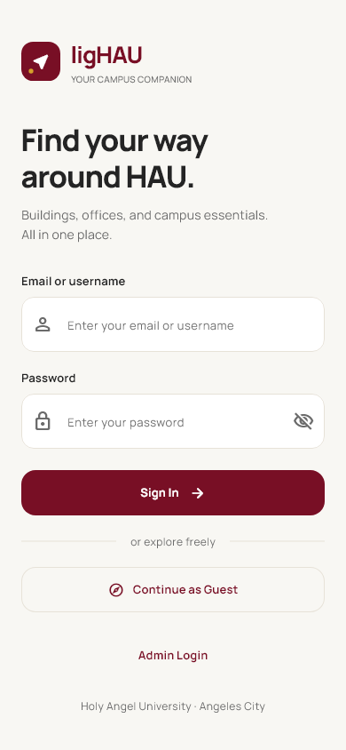
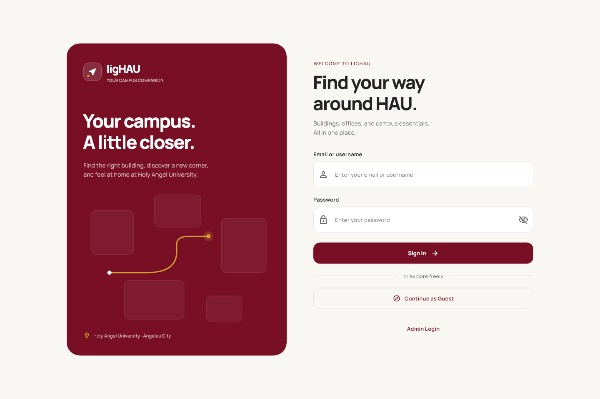
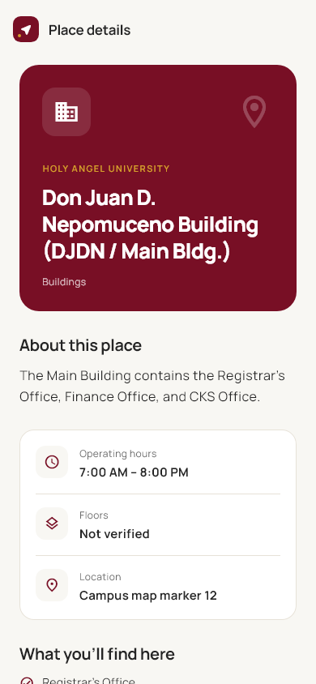

# Design system

ligHAU is a calm campus guide: warm ivory surfaces, burgundy navigation accents,
and gold highlights. The palette is preserved from the original app.

## Palette

| Role | Color | Use |
| --- | --- | --- |
| Primary | `#780F25` | Branding, primary actions, selected controls |
| Accent | `#D5A02B` | Route artwork and selected map icon borders |
| Background | `#F8F7F3` | Page backgrounds |
| Surface | `#FFFFFF` | Directory, fields, and information cards |
| Text | `#242424` | Primary text |
| Secondary text | `#6B6B6B` | Supporting copy and captions |
| Border | `#E7E2D8` | Subtle dividers and card boundaries |

Gold is used as an accent; small white text on gold is avoided.

## Type scale

Manrope is bundled in `assets/fonts/Manrope.ttf`, so interface text does not
require a Google Fonts network request. Source:
https://github.com/google/fonts/tree/main/ofl/manrope
License: SIL Open Font License, included in `assets/fonts/OFL.txt`.

| Role | Size | Weight |
| --- | --- | --- |
| Welcome display | 44 | 800 |
| Mobile welcome | 34 | 800 |
| Page headline | 26 | 800 |
| Section heading | 20 | 700 |
| Place title | 15 | 700 |
| Body | 14–16 | 400 |
| Button | 13 | 700 |
| Supporting copy | 12 | 400 |
| Caption | 11 | 600 |

Headings use tighter letter spacing. Body text uses 1.5–1.6 line height.
Long facility names wrap rather than forcing horizontal overflow.

## Spacing and layout

Use 4, 8, 16, 24, 32, and 48 pixel increments. Inputs and buttons share
consistent dimensions and corner radii. Main cards use 16–24 pixel radii,
subtle borders, and minimal shadows.

At 900 pixels and wider, the campus directory occupies a 340 pixel sidebar.
The map fills the remaining space. On mobile, search and category filters sit
above the map; a Browse action opens a scrollable directory sheet. Selection
information sits below the map, keeping pins and attribution visible.

The welcome screen uses two columns on desktop and a single scrollable column
on mobile. Details, search, and chat are constrained to 760 pixels; admin
content to 1000 pixels. Keyboard space is handled by the scaffold.

## Components

| Component | File | Purpose |
| --- | --- | --- |
| BrandLockup / BrandMark | `lib/widgets/brand_lockup.dart` | Consistent app wordmark and direction mark |
| AppHeader / PageBody | `lib/widgets/app_header.dart` | Shared secondary page headers and content widths |
| FacilityCard | `lib/widgets/facility_card.dart` | Wrapping place titles with selection state |
| CategoryFilter | `lib/widgets/category_filter.dart` | Burgundy selected category chips |
| AppTheme | `lib/theme/app_theme.dart` | Typography, palette, fields, buttons, cards |

The ligHAU mark is app branding, not an official university seal. Its direction
arrow and gold location dot are reused in the browser favicon. Brand placement
is consistent: above the welcome form on mobile, in the desktop welcome panel,
and at the top left of the map. Secondary pages use the compact mark with their
page title. The assistant is accessed from the map header rather than a floating
button overlapping map content.

## Screen previews

Previews are rendered from Flutter widgets using the bundled typeface and icons.

## Validation

`test/responsive_layout_test.dart` checks all six screens at 320 and 1440 pixels,
including opening the mobile directory and selecting a place with no coordinates.

## Changes since the last version

2026-10-04: Added bundled typography, shared branding, responsive map navigation,
a redesigned welcome page, and consistent details, search, assistant, and admin
page styling. Unverified accessibility badges were removed from place details;
the return action says Back to map instead of claiming a route was highlighted.
